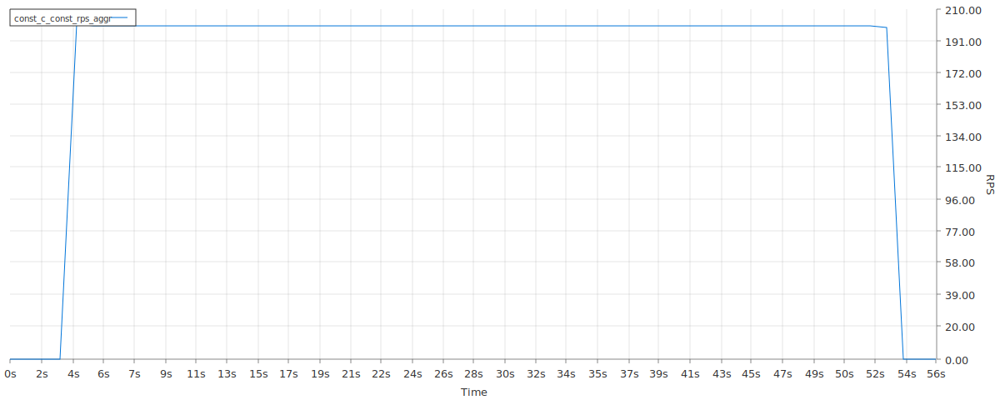
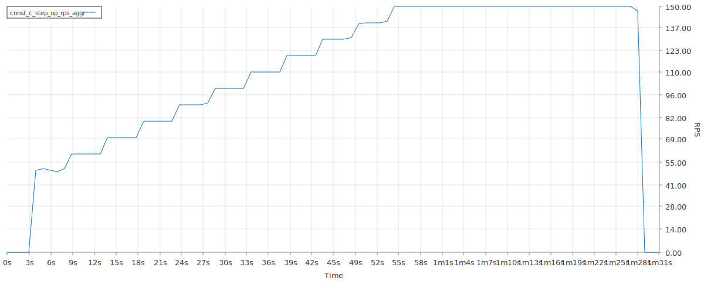

This is a walkthrough of different load options available to control the rate in requests per second (RPS) that `ghz` attempts to make to the server. All examples are done using a simple unary gRPC call.

## Constant RPS

```
ghz --insecure --async --proto /protos/helloworld.proto --call helloworld.Greeter/SayHello -d '{"name":"{{.WorkerID}}"}' 0.0.0.0:50051 -c 10 -n 10000 --rps 200

Summary:
  Count:	10000
  Total:	50.05 s
  Slowest:	56.17 ms
  Fastest:	50.17 ms
  Average:	50.58 ms
  Requests/sec:	199.79

Response time histogram:
  50.167 [1]	|
  50.768 [8056]	|∎∎∎∎∎∎∎∎∎∎∎∎∎∎∎∎∎∎∎∎∎∎∎∎∎∎∎∎∎∎∎∎∎∎∎∎∎∎∎∎
  51.368 [1900]	|∎∎∎∎∎∎∎∎∎
  51.968 [37]	|
  52.568 [1]	|
  53.169 [0]	|
  53.769 [0]	|
  54.369 [1]	|
  54.969 [1]	|
  55.569 [0]	|
  56.170 [3]	|

Latency distribution:
  10 % in 50.32 ms
  25 % in 50.40 ms
  50 % in 50.56 ms
  75 % in 50.72 ms
  90 % in 50.88 ms
  95 % in 51.00 ms
  99 % in 51.23 ms

Status code distribution:
  [OK]   10000 responses
```

This will perform a constant load RPS against the server. Graphed, it may look like this:



## Step Up RPS

```
ghz --insecure --async --proto /protos/helloworld.proto --call helloworld.Greeter/SayHello -d '{"name":"{{.WorkerID}}"}' 0.0.0.0:50051 -c 10 -n 10000 --load-schedule=step --load-start=50 --load-end=150 --load-step=10 --load-step-duration=5s

Summary:
  Count:	10000
  Total:	85.05 s
  Slowest:	60.16 ms
  Fastest:	50.18 ms
  Average:	51.10 ms
  Requests/sec:	117.57

Response time histogram:
  50.181 [1]	|
  51.179 [5713]	|∎∎∎∎∎∎∎∎∎∎∎∎∎∎∎∎∎∎∎∎∎∎∎∎∎∎∎∎∎∎∎∎∎∎∎∎∎∎∎∎
  52.177 [3923]	|∎∎∎∎∎∎∎∎∎∎∎∎∎∎∎∎∎∎∎∎∎∎∎∎∎∎∎
  53.174 [311]	|∎∎
  54.172 [46]	|
  55.170 [0]	|
  56.168 [1]	|
  57.166 [1]	|
  58.164 [2]	|
  59.161 [0]	|
  60.159 [2]	|

Latency distribution:
  10 % in 50.48 ms
  25 % in 50.68 ms
  50 % in 51.07 ms
  75 % in 51.41 ms
  90 % in 51.68 ms
  95 % in 52.02 ms
  99 % in 52.77 ms

Status code distribution:
  [OK]   10000 responses
```

Performs step load starting at `50` RPS and inscreasing by `10` RPS every `5s` until we reach `150` RPS at which point the load is sustained at constant RPS rate until we reach `10000` total requests. The RPS load is distributed among the `10` workers, all sharing `1` connection.



## Step Down RPS

```
ghz --insecure --async --proto /protos/helloworld.proto --call helloworld.Greeter/SayHello -d '{"name":"{{.WorkerID}}"}' 0.0.0.0:50051 -c 10 -n 10000 --load-schedule=step --load-start=200 --load-step=-10 --load-step-duration=5s --load-max-duration=40s

Summary:
  Count:	10000
  Total:	68.38 s
  Slowest:	55.88 ms
  Fastest:	50.16 ms
  Average:	50.85 ms
  Requests/sec:	146.23

Response time histogram:
  50.159 [1]	|
  50.730 [4367]	|∎∎∎∎∎∎∎∎∎∎∎∎∎∎∎∎∎∎∎∎∎∎∎∎∎∎∎∎∎∎∎∎∎∎∎∎∎∎∎∎
  51.302 [4281]	|∎∎∎∎∎∎∎∎∎∎∎∎∎∎∎∎∎∎∎∎∎∎∎∎∎∎∎∎∎∎∎∎∎∎∎∎∎∎∎
  51.874 [1304]	|∎∎∎∎∎∎∎∎∎∎∎∎
  52.446 [43]	|
  53.018 [0]	|
  53.590 [0]	|
  54.162 [2]	|
  54.734 [0]	|
  55.306 [0]	|
  55.877 [2]	|

Latency distribution:
  10 % in 50.45 ms
  25 % in 50.60 ms
  50 % in 50.77 ms
  75 % in 51.06 ms
  90 % in 51.38 ms
  95 % in 51.54 ms
  99 % in 51.79 ms

Status code distribution:
  [OK]   10000 responses
```

Performs step load starting at `200` RPS and decreasing by `10` RPS every `10s` until `40s` has elapsed at which point the load is sustained at that RPS rate until we reach `10000` total requests. The RPS load is distributed among the `10` workers, all sharing `1` connection.


